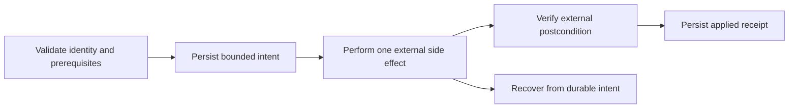

# Extending Shea Halo safely

A Shea Halo feature is rarely isolated to one function. Changes that affect
durable state, external side effects, or promotion evidence must preserve the
same identity across strict models, workpad recovery, service orchestration,
security boundaries, and tests. Start by naming the authority and receipt the
change introduces.

## Change map

| Change | Start here | Follow through | Required proof |
|---|---|---|---|
| Persisted lifecycle field or phase | `src/shea_halo/models.py` | `workpad.py`, phase branches and re-entry in `service.py`, documentation | Strict validation, old/new state behavior, interruption and recovery tests. |
| Outcome or Project routing rule | `models.py`, `HaloService._gate_outcome`, `_route` | `github.py`, terminal transition reconciliation, target config | Gate failures stay in research; pending/applied ordering and monotonic reconciliation remain intact. |
| Shared target configuration | `src/shea_halo/config.py` | committed example, README/config wiki, call sites | Valid/invalid parsing, local replacement semantics, safe defaults, and no credential values in committed config. |
| Setup/experiment/verification action | `config.py`, `agent.py` | receipts in `models.py`, candidate binding in `service.py` | Exact argv execution, stage separation, bounded output hashes, environment allowlist, failure classification. |
| New observation type | `src/shea_halo/observation.py` | checkpoint/delta models, fingerprinting and candidate selection in `service.py` | Controlled roots, stable logical labels, size/count bounds, race-resistant reads, deterministic ordering, cleanup rules. |
| Trace semantic or integration support | `trace_semantics.py`, `integrations.py` | `observation.py`, `halo_engine.py`, prompts/contracts | Provenance-preserving normalization, conflict evidence, exact dataset selection, synthetic positive and negative fixtures. |
| HALO Engine artifact | `src/shea_halo/halo_engine.py` | runtime filesystem, sanitization, result/workpad receipt | Temporary raw intermediates, bounded durable schema, path/secret redaction, dataset and revision identity. |
| Git worktree/publication behavior | `src/shea_halo/workspace.py` | `models.py`, service intent ordering, GitHub PR-history checks | Repository/remote identity, manifest stability, sensitive path rejection, crash recovery, remote postconditions. |
| GitHub Project or Issue operation | `src/shea_halo/github.py` | service ordering, workpad evidence, target tracker config | Complete inventory, expected identity/status recheck, sanitized errors, partial-side-effect reconciliation. |
| Managed runtime file | `src/shea_halo/runtime_fs.py` | owning adapter/service, security sanitization | Containment, no-follow behavior, link/race tests, atomicity, safe removal, logical labels instead of host paths. |

## Persisted-state protocol

When adding durable state:

1. Model it with strict bounded types. Reject extra or phase-incompatible data.
2. Decide whether the field is authority, an intent recorded before a side
   effect, or a receipt recorded after it.
3. Define restart behavior for every phase in which the field can be present.
4. Include only sanitized, bounded, publicly safe data in a workpad entry.
5. Add tests for malformed state, interrupted writes, re-entry, and stale or
   conflicting external state.

Do not add a field merely because it is useful for logging. Durable workpad
state must support a recovery or routing decision; local diagnostic data belongs
behind the contained runtime boundary.

## External-side-effect protocol

For a new GitHub, Git, filesystem, network, or process side effect:



Not every operation needs a new workpad intent, but every non-idempotent durable
effect needs an explicit answer to “what if the process stops immediately
afterward?” Preserve least capability in investigator tools and environment
handling; deterministic adapters, not model output, should own side effects
(`src/shea_halo/agent.py`, `src/shea_halo/security.py`).

## Adding observation or tracing support

Prefer framework-native OpenTelemetry/OpenInference instrumentation. An
integration may help select official guidance or configure a supported SDK, but
must not introduce a Shea-specific span schema or depend on HALO Desktop private
storage. A real tracing experiment still has the dual-output contract: live
OTLP plus canonical JSONL.

New evidence must answer:

- Which controlled root and committed glob admits it?
- What stable logical identity and digest represent it?
- How is it separated from setup, historical, or verification-only output?
- How is it bound to `candidate_revision` and `service.version`?
- What raw data stays temporary, and what bounded receipt may be persisted?
- Which ambiguity conditions fail closed?

Use synthetic fixtures for trace shapes and failures. Do not commit real private
traces, prompts, or model/tool payloads.

## Verification strategy

Run the full repository sequence after focused tests:

```text
uv run ruff format --check .
uv run ruff check .
uv run basedpyright
uv run pytest
uv build
```

Add focused tests at the lowest owning layer, then a service test when the
change affects lifecycle or promotion. Security-sensitive work should include
negative tests for identity mismatch, malformed input, bounds, symlinks/links,
partial failure, stale state, and sanitization—not only the happy path. The
[contributor guide](/openwiki/operations/contributing.md) contains the broader
test ownership map.

## Documentation and backlog boundary

Update the README when the maintained product contract changes, then update the
smallest relevant wiki pages. Describe proposed work only by linking its live
GitHub Issue; the wiki is not a second backlog. For a complete research trace
bundle, wait until Issue #9's model, serializer, lifecycle attachment, and tests
are merged before documenting them as shipped behavior.
