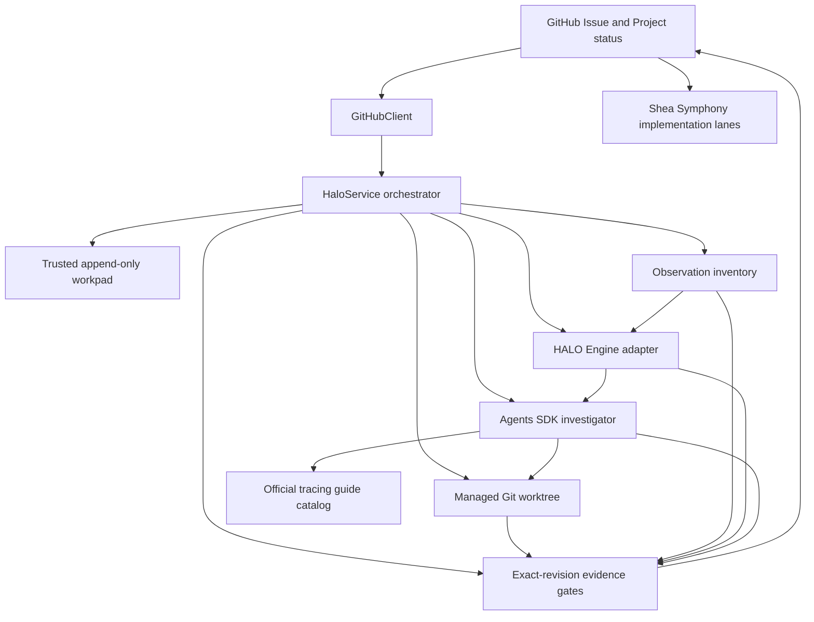

# Shea Halo architecture and source map

Shea Halo is a long-running Python worker whose control plane is a GitHub Issue plus its GitHub Project status. `python -m shea_halo` accepts no action arguments; `HaloService` polls configured targets, processes items in `Halo Research`, and reconciles interrupted terminal transitions for items that have already moved to another status (`src/shea_halo/__main__.py`, `src/shea_halo/service.py`). The worker is configured per target repository, not by the committed Shea Symphony workflow for this repository.

## Product boundary

Halo owns research: it reads untrusted Issue discussion, inventories observations, asks an investigator to run bounded experiments in a managed Git worktree, publishes immutable experimental snapshots when source changes exist, and applies evidence gates before changing the Project status. Its [research lifecycle](/openwiki/workflows/research-lifecycle.md) persists every durable step as a trusted append-only Issue comment.

A `ready_for_todo` result that passes the mechanical gates moves the **same Project item** to `Todo`; that is a handoff, not implementation by Halo. Shea Symphony then owns implementation, review, and merge through its separate lanes, worktree, and branch contracts in `.shea/workflows/shea-symphony.md` and adjacent prompts. A Halo branch carries `reuse_policy: experimental_snapshot_only`, so it is reference evidence for selective adoption rather than a PR branch or a workspace Symphony may continue (`src/shea_halo/models.py`, `src/shea_halo/workspace.py`, `tests/test_service.py`).

These are two distinct Project configurations:

- each observed target's `.shea/halo.toml` tells Halo which repository, Project, field, and research/ready/done/blocked states to use (`src/shea_halo/config.py`);
- `.shea/workflows/shea-symphony.md` binds this repository's implementation pipeline to GitHub Project #11 and defines `Todo` and `Rework` as active Symphony states.

## Runtime components

*The worker keeps GitHub as the durable control plane while local worktrees, observations, HALO analysis, and model decisions feed fail-closed routing gates.*

### Orchestration and durable state

`HaloService` is the transaction coordinator (`src/shea_halo/service.py`). For each configured target it acquires a local worker lease, loads Project metadata and all Project Issues through `GitHubClient`, processes matching `Halo Research` items serially, and checks non-research items for an unfinished status-transition receipt. `models.py` defines strict persisted phases (`research`, `experimenting`, `validating`, `ready`, `done`, and `blocked`) and rejects incoherent combinations of validation baselines, publication intents, results, and status transitions.

The workpad is the durable journal rather than a local database. `workpad.py` accepts state only from configured trusted producers, requires one linear predecessor chain with consecutive revisions, and rejects edited trusted entries, forks, cycles, and disconnected histories. Marker-like comments from other authors remain ordinary untrusted discussion. This journal design allows the service to reconstruct or recover work after interruption while the [security boundary](/openwiki/architecture/security.md) prevents public Issue text from becoming authority.

### GitHub adapter

`github.py` isolates GitHub access behind the `gh` CLI and GraphQL/REST calls. It inventories Project items across statuses, reads Issue comments, confirms that an item still has the expected repository identity and remains in `Halo Research` before side effects, checks the complete same-repository PR history for a Halo branch, appends comments, and changes the Project status. Only GitHub-related environment names are passed to `gh`, and command failures are redacted (`src/shea_halo/github.py`, `tests/test_github.py`).

Terminal routing is intent-first: the service appends a `pending` status transition, writes the Project field, then appends `applied`. On restart it can complete the receipt without repeating the status write; if a downstream state such as `In Progress` has superseded Halo's pending target, it records that fact and does not move the item backward (`src/shea_halo/service.py`, `tests/test_service.py`).

### Workspace and publication boundary

`WorkspaceManager` owns `.shea/worktrees/halo/` below the target checkout. It pins a research lifecycle to its initial base revision, creates the stable `halo/issue-<number>-<slug>` branch, validates restored local and remote state, and refuses publication if the branch has any PR history. Agent patches are constrained to non-sensitive repository files and cannot modify `.shea`, Git control files, ignored files, or paths outside the worktree (`src/shea_halo/agent.py`, `src/shea_halo/workspace.py`).

Before commit or push, the service records a `PublicationIntent` containing the parent revision and exact path manifest. `WorkspaceManager` then revalidates content, commit metadata, remote authority, and the recorded manifest, making a crash before or after push recoverable only for that exact snapshot. The snapshot is subsequently checked out into a clean validation workspace. These controls are heavily exercised by `tests/test_workspace.py`, including tampered heads/remotes, unsafe paths and content, hook rewrites, post-intent changes, and interrupted publication.

### Observation and analysis pipeline

`observation.py` inventories configured canonical JSONL traces and optional bounded Desktop reports in both the target checkout and active experiment worktree. Trace files are size/count bounded, validated against the installed HALO Engine `SpanRecord` contract, summarized by stable logical labels and digests, and projected through fail-closed trace semantics before they become evidence. The detailed [observability pipeline](/openwiki/workflows/observability.md) explains Catalyst/OpenTelemetry/OpenInference, HALO Desktop's optional public-surface preflight, canonical JSONL, semantic receipts, and local-only artifacts.

`HaloEngineAdapter` selects either all discovered traces for preliminary context or an exact digest set for candidate analysis. It uses HALO Engine's public async API, keeps indexes and raw intermediate telemetry in a temporary directory, and writes only sanitized local `analysis.json`, `events.jsonl`, `report.md`, and `halo-telemetry.jsonl` artifacts (`src/shea_halo/halo_engine.py`, `tests/test_halo_engine.py`). Recent trace-semantics work added provenance-preserving alias normalization and fail-closed agent attribution/token rollups. The committed FailureReport fixtures prove those deterministic semantics; the separate append-only [FailureReport #26](https://github.com/Alive24/FailureReport/issues/26) record carries the authorized real-trace research evidence without committing raw source traces (`src/shea_halo/trace_semantics.py`, `tests/fixtures/eve-semantics/README.md`).

### Investigator and revision-bound decision

`Investigator` uses the OpenAI Agents SDK with Catalyst tracing. It discovers dependencies from bounded manifests, ranks current official tracing guides dynamically, exposes constrained repository and configured-action tools, and records action receipts rather than raw command output (`src/shea_halo/agent.py`, `src/shea_halo/integrations.py`). The selected OpenAI API mode is explicit and shared by investigator, final synthesis, and HALO Engine calls; an unsupported route becomes a structured blocker rather than silently falling back (`src/shea_halo/provider.py`, `src/shea_halo/service.py`).

A source-changing preliminary result is not terminal. After an experimental snapshot is published, `HaloService` runs setup, target-owned runtime experiments, and deterministic verification with the candidate revision as `service.version`. It freezes the experiment-created observation delta, rejects evidence changed by verification, analyzes exactly the candidate trace digests, and asks a separate zero-tool synthesis turn to decide from the bounded exact-revision record. `_gate_outcome` mechanically demotes unsupported `ready_for_todo` or `no_change` claims to `continue_research` (`src/shea_halo/service.py`, `tests/test_service.py`). This separation keeps exploratory model claims subordinate to revision-bound receipts.

## Failure and recovery shape

Architecture-level recovery is deliberately append-only and fail-closed:

- an unchanged `continue_research` item is skipped using a fingerprint over Issue/discussion, observations, branch snapshot, effective experiment contract, and worker source; relevant new evidence reopens it;
- an interrupted unpublished attempt is discarded back to its persisted base or snapshot before research resumes;
- a persisted publication intent resumes only if the exact manifest and Git state still match;
- an interrupted validation clears branch-external worktree state and reruns from its persisted observation baseline;
- base-branch drift, branch/remote tampering, unsafe cleanup, missing credentials, and verified external capability failures route to structured blocking behavior rather than broad best-effort recovery.

See the [research lifecycle](/openwiki/workflows/research-lifecycle.md) for state-by-state semantics and [contributor operations](/openwiki/operations/contributing.md) for diagnostics and verification commands.

## Source map and change guidance

| Concern | Primary source | Contract tests or companion evidence |
|---|---|---|
| Worker entry and polling | `src/shea_halo/__main__.py`, `service.py`, `locking.py` | `tests/test_main.py`, `tests/test_service.py`, `tests/test_locking.py` |
| Persisted phases and evidence | `src/shea_halo/models.py`, `workpad.py` | `tests/test_workpad.py`, lifecycle-model cases in `tests/test_service.py` |
| GitHub Project and Issue I/O | `src/shea_halo/github.py` | `tests/test_github.py` |
| Investigator and configured actions | `src/shea_halo/agent.py`, `provider.py` | `tests/test_agent_boundaries.py`, `tests/test_provider.py` |
| Managed branch and publication | `src/shea_halo/workspace.py`, `security.py` | `tests/test_workspace.py`, `tests/test_security.py` |
| Observation and trace semantics | `src/shea_halo/observation.py`, `trace_semantics.py` | `tests/test_observation.py`, `tests/test_trace_semantics.py` |
| Guide and Desktop integration | `src/shea_halo/integrations.py` | `tests/test_integrations.py`, `tests/test_config.py` |
| HALO Engine boundary | `src/shea_halo/halo_engine.py` | `tests/test_halo_engine.py` |
| Symphony implementation lanes | `.shea/workflows/shea-symphony.md`, `.shea/prompts/`, `.shea/template/` | `.shea/README.md`; no dedicated compatibility test is currently tracked |

Start orchestration changes in `service.py`, but trace every new durable step through `models.py` and `workpad.py`, every Git side effect through `workspace.py` or `github.py`, and every persisted value through the security/runtime filesystem boundary. Changes to candidate evidence must preserve the separation between exploratory actions and post-publication validation, and should extend the exact-revision gate tests in `tests/test_service.py`. Changes to `.shea/workflows/` affect Symphony's implementation pipeline, not Halo's target-research runtime; do not patch vendored `.shea/app/` or `.shea/bin/` to alter tracker policy (`.shea/README.md`).

The repository history reflects this boundary hardening: lifecycle re-entry and turn-limit checkpoints were followed by intent-bound publication, exact runtime-receipt evidence, explicit provider API mode, fail-closed trace attribution, and opt-in external Desktop preflight. The newest commits update vendored Symphony production assets and binaries, leaving the Python research architecture and the Halo-to-Symphony authority handoff unchanged.
