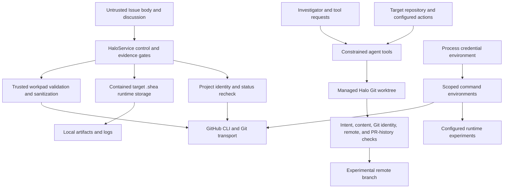

# Shea Halo security and trust boundaries

Shea Halo treats public Issue content, the investigator model, repository contents, process output, local runtime state, and existing Git refs as inputs to validate—not as authority. Authority is split across configured GitHub identity and Project state, the validated append-only workpad, the configured target checkout and remote, and deterministic publication/evidence gates. The [architecture overview](/openwiki/architecture/overview.md) shows where these controls sit in the worker; this page defines the security contract behind that flow.

## Trust zones

*Data crosses into durable GitHub state, a remote branch, or local runtime storage only through purpose-specific validation and sanitization gates.*

| Zone | Trust posture | Enforced boundary |
|---|---|---|
| GitHub Issue and discussion | Untrusted product input | Issue text informs research, but marker-like comments are not workpad authority unless authored by a configured trusted producer (`src/shea_halo/workpad.py`, `tests/test_workpad.py`). |
| Trusted GitHub control plane | Conditional authority | The worker validates Project metadata, item repository/number identity, current `Halo Research` status, authenticated comment authorship, and complete same-repository PR history before relevant side effects (`src/shea_halo/github.py`, `src/shea_halo/service.py`, `tests/test_github.py`, `tests/test_service.py`). |
| Investigator and repository tools | Untrusted decision/input with bounded capability | Tool paths, patches, searches, action selection, outputs, and turn results are constrained and later subordinated to deterministic service gates (`src/shea_halo/agent.py`, `tests/test_agent_boundaries.py`). |
| Managed worktree and Git repository | Mutable experimental state | `WorkspaceManager` pins branch/base identity, validates local and remote state, and publishes only an intent-bound snapshot to the configured repository (`src/shea_halo/workspace.py`, `tests/test_workspace.py`). |
| Target-owned `.shea` runtime tree | Local operational state, not publication authority | `RuntimeFilesystem` contains access below one target’s `.shea`, rejects unsafe links and path traversal, and uses race-resistant file operations (`src/shea_halo/runtime_fs.py`, `tests/test_runtime_fs.py`). |
| Durable comments, artifacts, errors, and branch metadata | Potential disclosure boundary | Persistence helpers redact credentials and host paths and raise when content cannot be made safe; publication separately rejects unsafe files and Git metadata (`src/shea_halo/security.py`, `src/shea_halo/workpad.py`, `src/shea_halo/workspace.py`, `tests/test_security.py`, `tests/test_workspace.py`). |

## Untrusted Issue input and workpad authority

The Issue title, body, and ordinary comments are research context, not commands or durable worker state. A comment becomes a workpad candidate only when its first non-empty line is the Halo marker **and** its author is in the configured trusted-producer set. Marker imitations by other participants remain ordinary discussion and are deliberately excluded from trusted comment IDs.

Trusted entries must target the current repository and Issue, name a producer matching the comment author, and form one immutable linear predecessor chain with consecutive revisions. Edited trusted comments, malformed entries, missing predecessors, forks, cycles, disconnected histories, producer mismatches, and an empty trusted-producer configuration raise `WorkpadError`; they are not repaired by choosing a plausible head. Before a new entry is posted, `render_entry` sanitizes both structured state and human summary and enforces a bounded GitHub comment size (`src/shea_halo/workpad.py`; spoofing, edit, fork, redaction, and host-path cases in `tests/test_workpad.py`).

This makes the workpad the recovery journal while keeping public Issue authors outside the state-authority zone. The service also rechecks that the Project item still has the expected repository and Issue number and remains in the research state before side effects; an item that moved or changed identity causes an error instead of continued mutation (`src/shea_halo/github.py`, call sites in `src/shea_halo/service.py`).

## Credential scope and command execution

Credential handling is allowlist- and purpose-based:

- General investigator subprocesses receive `sanitized_environment()`, which removes names associated with keys, tokens, secrets, passwords, credentials, authentication, and known credential-provider settings.
- Configured target credentials are copied from the worker environment only by names explicitly listed in configuration, and only when `include_runtime_credentials` is enabled for an experiment action. Setup and verification do not receive that opt-in path (`target_environment` and action execution in `src/shea_halo/agent.py`; environment/output assertions in `tests/test_agent_boundaries.py`).
- Git commands use `git_environment()`: raw credential variables and ambient Git configuration controls are removed, selected authentication **handles** may remain, and `GIT_NO_REPLACE_OBJECTS=1` prevents replace refs from changing the object being validated (`src/shea_halo/security.py`, `src/shea_halo/workspace.py`, `tests/test_security.py`, `tests/test_workspace.py`).
- `gh` receives only a fixed set of GitHub, proxy, locale, certificate, path, and config variables, with prompting disabled. Startup and command errors are redacted before becoming exceptions (`src/shea_halo/github.py`, `tests/test_github.py`).

Command output is not durable evidence by default. Agent action receipts retain bounded status and digests rather than raw stdout/stderr, and surfaced diagnostic text passes through redaction. This limits accidental credential propagation even when a target experiment legitimately needs a configured runtime credential (`src/shea_halo/agent.py`, `tests/test_agent_boundaries.py`).

## Runtime filesystem containment

`RuntimeFilesystem` roots managed operational access at exactly one target checkout’s `.shea` directory. It rejects lexical `..`, paths outside that root, missing or ambiguous `.shea` roots, symlink or non-directory parents, symlink leaves, non-regular files, and multiply linked files. Directory traversal uses directory file descriptors with `O_NOFOLLOW`; writes use a private exclusive temporary file, `fsync`, and atomic replacement; append and read operations revalidate the opened file. Tree deletion first validates the full managed tree and aborts on links or non-regular entries (`src/shea_halo/runtime_fs.py`).

Tests verify that attempts cannot escape through parent segments, parent symlinks, leaf symlinks, hard links, or unsafe deletion entries, while normal writes, appends, reads, and removals stay below the target-owned `.shea` root (`tests/test_runtime_fs.py`). These local artifacts and logs are operational state; they do not become branch content or trusted GitHub state merely because they exist.

## Agent and workspace containment

The investigator reads only repository-relative paths that remain inside the resolved managed worktree. Git and SSH internals and conventionally sensitive paths are excluded. Repository listing and search filter sensitive paths, line reads are bounded, and patch targets cannot enter `.shea`, alter Git control/ignore files, escape the worktree, or create ignored branch-external files. The model can execute only the exact operator-configured action at a listed integer index; it cannot supply an arbitrary command through that tool (`src/shea_halo/agent.py`, `tests/test_agent_boundaries.py`).

`WorkspaceManager` adds a second boundary around the resulting filesystem changes. A lifecycle uses the generated `halo/issue-<number>-<slug>` branch and persisted base revision. Existing worktrees must match the expected top-level path and branch; restored local `HEAD`, remote branch, dirty paths, persisted snapshot, and publication intent must agree. Before exact-revision validation, unrecorded source changes are forbidden and ignored worktree state—including worktree-local `.shea`—is cleared so validation rebuilds from the published Git snapshot (`src/shea_halo/workspace.py`; tampered-head, remote, dirty-state, cleanup, and validation cases in `tests/test_workspace.py`).

## Branch authority and publication

A Halo branch is an experimental snapshot, not an implementation or PR branch. The service checks the branch’s complete same-repository PR history before preparation and publication and refuses use when any open, closed, or merged PR exists. The GitHub search fails closed if pagination, count stability, completeness, repository/ref identity, or the bounded complete-search window cannot be established (`src/shea_halo/github.py`, `src/shea_halo/service.py`, `tests/test_github.py`, `tests/test_service.py`).

Publication is intent-first and exact:

1. `create_publication_intent` requires the expected parent, validates every changed path, and records a digest plus per-path state, content hash, canonical Git blob identity, size, and executable bit.
2. Snapshot validation rejects sensitive filenames, `.shea` runtime content, unsafe path types, ignored or opaque changes where safety cannot be established, newly introduced credential material, and host-specific absolute paths. Deleting pre-existing unsafe material is allowed; moving or newly adding it is not (`src/shea_halo/workspace.py`, `tests/test_workspace.py`).
3. Before and after commit, the manager revalidates the manifest, one-parent ancestry, exact commit message, UTF-8 metadata, fixed Halo author/committer identity, clean worktree, configured GitHub repository, origin fetch/push URL, URL rewrites, and allowed remote head.
4. Push uses a temporary ref bound to the validated object ID. Afterward, both remote branch and local `HEAD` must still equal that object; interrupted publication can resume only when persisted intent and current state still match.

These checks prevent ambient hooks, replace refs, remote retargeting, local races, or post-intent edits from silently changing the published artifact (`src/shea_halo/workspace.py`; hook rewrite, origin retargeting, object identity, head movement, recovery, and post-intent tests in `tests/test_workspace.py`).

## Persistence sanitization

`security.py` separates redaction from admission. It recognizes environment-known secrets, common token formats, authorization and cookie headers, private-key blocks, credentials embedded in URLs, sensitive assignments, conventional credential files, and host-specific POSIX, Windows, UNC, and file-URI paths. Repository-relative paths, URL routes, safe interpreter shebangs, and explicit aggregate telemetry counts have narrow allowances.

`sanitize_persisted_text` redacts credentials and replaces known local roots with logical labels before rejecting any residual sensitive material or host absolute path. `sanitize_persisted_data` applies the same policy recursively and fails if sanitized mapping keys collide, avoiding silent data overwrite. These functions protect workpad summaries/state, agent prompts and synthesized records, service diagnostics, HALO analysis artifacts, and trace-semantic output; branch publication performs an additional source-content and Git-metadata admission check rather than trying to rewrite candidate code (`src/shea_halo/security.py`, call sites across `workpad.py`, `agent.py`, `service.py`, `halo_engine.py`, and `trace_semantics.py`; `tests/test_security.py`).

Sanitization is a last boundary, not permission to persist raw prompts, model output, tool arguments/results, traces, endpoint values, or private workpad payloads indiscriminately. Persist only the bounded receipts and summaries defined by the owning component.

## Fail-closed behavior and change guidance

The common rule is: if identity, completeness, containment, safety, or exact revision cannot be proven, stop the operation or route through structured blocking/recovery logic rather than guessing. Representative failures include malformed or edited trusted workpad state, a Project item leaving research, unavailable complete PR history, unsafe runtime filesystem components, excluded agent paths, unexpected Git state, origin or branch drift, unsafe publication content, and text that remains sensitive after sanitization.

When changing this boundary:

- extend `tests/test_security.py` for new redaction/admission forms and false-positive allowances;
- extend `tests/test_runtime_fs.py` for path, link, race-resistant I/O, or deletion behavior;
- extend `tests/test_agent_boundaries.py` for tool capability, path, action, environment, and output-receipt rules;
- extend `tests/test_workpad.py` for producer, immutability, chain, size, and sanitization rules;
- extend `tests/test_github.py` and `tests/test_service.py` for control-plane identity, PR-history completeness, status rechecks, and side-effect ordering;
- extend `tests/test_workspace.py` for every new publication path, Git-state assumption, remote check, recovery state, and hook/race scenario.

Do not weaken one layer because another usually catches the same input. The security design intentionally combines capability restriction, identity checks, immutable receipts, exact-object validation, containment, sanitization, and postcondition checks so recovery remains conservative under partial failure.
