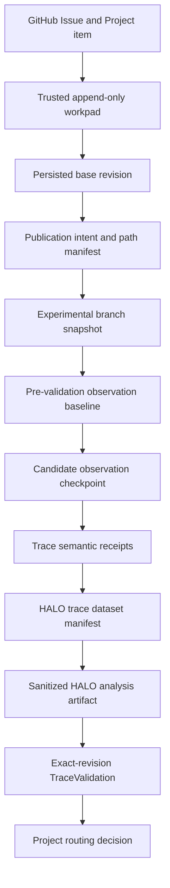

# Durable evidence and provenance model

Shea Halo does not promote a research conclusion because a model stated it or
because a local file exists. It builds a chain of strict, sanitized receipts
that connects a GitHub Project item, a trusted workpad revision, an exact Git
revision, the observations produced at that revision, and the resulting
analysis. An ambiguous or incomplete link keeps the item in research or routes
it through a structured blocker instead of weakening the gate
(`src/shea_halo/models.py`, `src/shea_halo/service.py`).

## The evidence chain

The arrows represent identity and provenance constraints, not a single bundled
file. Each structure has a narrower responsibility:

| Structure | Durable identity it carries | What it proves |
|---|---|---|
| `WorkpadEntry` / `HaloState` | Issue identity, run, phase, predecessor, base, branch, intents, result, and pending transition | The one trusted, append-only control-state history. |
| `PublicationIntent` | Parent revision plus a digest of the bounded path manifest | What Shea Halo intends to commit before the Git side effect occurs. |
| `BranchSnapshot` | Branch name and exact `head_revision` | The published experimental source revision; it remains reference-only. |
| `ObservationCheckpoint` | Stable logical labels, hashes, sizes, and bounded trace summaries | A deterministic inventory of controlled target/worktree evidence without persisted host paths. |
| `TraceSemanticReceipt` | Trace/span provenance, normalized agent attribution, and bounded token contributions | The canonical semantics projected from one trace, including the source keys used. |
| `TraceDatasetManifest` | Exact trace file digests, harness revision, and receipt-derived totals | The dataset HALO Engine actually analyzed. |
| `TraceValidation` | Candidate revision, selected observations, HALO report digest, and verification flags | Whether the candidate trace hierarchy and analysis are complete and bound to the published revision. |

## Workpad authority

The workpad is a linear chain of GitHub Issue comments created by configured
trusted producers. Each entry names its predecessor and increments the revision.
Edited trusted comments, forks, gaps, cycles, disconnected histories, identity
mismatches, or an untrusted producer fail validation. Marker-like comments from
other Issue participants remain ordinary discussion and never become state
(`src/shea_halo/workpad.py`, `tests/test_workpad.py`).

`HaloState` is strict: lifecycle-only fields are valid only in the phases that
can safely recover them. For example, validation requires a base revision,
investigation result, and observation baseline; a publication intent is valid
only while experimenting; and a terminal state requires a matching terminal
outcome (`src/shea_halo/models.py`, `tests/test_service.py`).

## Intent before publication

Before committing or pushing experiment changes, `WorkspaceManager` validates
the bounded source diff and creates a `PublicationIntent`. Its manifest records
each permitted path, file/deletion state, content digest, Git blob identity,
size, and executable bit. The intent is appended to the workpad before the Git
side effect. Publication then revalidates the manifest, repository and remote
identity, parent and resulting commit, clean state, and remote head
(`src/shea_halo/workspace.py`, `tests/test_workspace.py`).

Once published, `BranchSnapshot.head_revision` is the candidate source
identity. Its `experimental_snapshot_only` policy means that it is evidence for
inspection or selective adoption, not an implementation branch and not a PR
handoff. Shea Symphony starts implementation separately.

## Observation and analysis identity

`ObservationCheckpoint` inventories only controlled target and worktree roots.
It uses stable logical labels plus digests rather than host paths. Trace
observations include topology counts, service-version coverage, and an optional
semantic receipt whose digest must match its canonical content
(`src/shea_halo/observation.py`, `tests/test_observation.py`).

For a tracing candidate, validation selects the experiment-only observation
delta and gives HALO Engine exactly those trace digests. `TraceDatasetManifest`
also carries the harness revision. A semantically complete dataset requires a
receipt for every file, and its token totals and agent identities must be
derived from those receipts. HALO Engine may use temporary indexes and raw
intermediate events, but only bounded, sanitized artifacts cross the durable
boundary (`src/shea_halo/halo_engine.py`, `src/shea_halo/trace_semantics.py`,
`tests/test_halo_engine.py`, `tests/test_trace_semantics.py`).

A complete `TraceValidation` requires candidate traces with parent/child
structure, a HALO report digest, verified dataset and revision, complete
`service.version` coverage, and the exact candidate revision. Verification
output or unrelated historical traces cannot silently enter the candidate
dataset (`src/shea_halo/observation.py`, `src/shea_halo/service.py`,
`tests/test_service.py`).

## Promotion and recovery consequences

- Promotion to `Todo` is permitted only when the result and mechanical evidence
  gates agree. A source diff or model claim alone is insufficient.
- Re-entry restores from persisted base/snapshot identity and the phase-specific
  workpad state. It does not infer that an unrecorded side effect succeeded.
- A pending Project transition is written before the status mutation and marked
  applied afterward, allowing the worker to reconcile a partial failure without
  moving an item backward.
- Unsafe cleanup, changed manifests, revision drift, incomplete GitHub history,
  or conflicting trace semantics stop the operation rather than repairing the
  evidence to fit the desired outcome.

See the [research lifecycle](/openwiki/workflows/research-lifecycle.md) for the
state sequence, [security boundaries](/openwiki/architecture/security.md) for
admission and persistence controls, and
[observability](/openwiki/workflows/observability.md) for the trace transport
and semantic contracts.

## Issue #9 boundary

On the documented base revision, these structures are related but do **not**
collectively constitute a first-class complete research trace bundle. Open
[Shea Halo #9](https://github.com/Alive24/shea-halo/issues/9) defines that
future aggregate. Until its implementation is merged and verified, do not
invent a bundle schema, serializer, lifecycle attachment, or retention contract
from the current evidence pieces. Update this page after the shipped model and
tests become authoritative.
