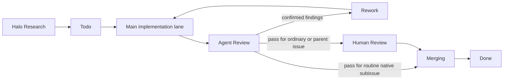

# Contributing and operations

Shea Halo is an alpha-stage Python 3.11–3.14 project managed with `uv`. Contributions must preserve its GitHub Issue and Project product surface, append-only research state, exact-revision evidence, constrained runtime filesystem, and separation between Halo research and Symphony implementation. Start with the [architecture and source map](/openwiki/architecture/overview.md), and consult the [research lifecycle](/openwiki/workflows/research-lifecycle.md) before changing orchestration or persisted state.

## Local setup and verification

Install the locked development environment, then run the same sequence used by CI and the committed Symphony workflow:

```text
uv sync --locked --all-groups
uv run ruff format --check .
uv run ruff check .
uv run basedpyright
uv run pytest
uv build
```

`pyproject.toml` applies Ruff's Python 3.11 target and 100-character line length, standard BasedPyright checking across `src` and `tests`, and Pytest auto mode for async tests. CI runs the sequence above on Python 3.12 for pull requests and pushes to `main` (`.github/workflows/ci.yml`). The package itself declares support for Python 3.11 through 3.14.

Run a focused test while iterating, but run the complete sequence before handoff. Examples:

```text
uv run pytest tests/test_service.py
uv run pytest tests/test_workspace.py -k publication
uv run pytest tests/test_runtime_fs.py tests/test_locking.py
```

Do not report a check as passing unless it was actually run. Ordinary tests are designed to avoid live model calls and GitHub mutations: they use temporary directories, local bare Git repositories, fake tracker data, recorded catalog fragments, and synthetic trace fixtures (`README.md`, `tests/conftest.py`, and the test tree).

## Test ownership map

Add or update the narrowest behavioral tests that own the changed contract, then include cross-boundary service coverage when orchestration changes.

| Changed area | Primary tests | Contract to protect |
|---|---|---|
| Lifecycle routing, re-entry, exact-revision validation, recovery, or structured worker events | `tests/test_service.py` | Outcome gates, transition reconciliation, snapshot-bound evidence, restart behavior, and local failure records. |
| Git worktrees, branch publication, repository identity, or cleanup | `tests/test_workspace.py` | Stable branch identity, pinned revisions, publication intents, remote authority, sensitive-file rejection, and safe recovery. |
| Investigator tools, action execution, command environments, or final synthesis | `tests/test_agent_boundaries.py` | Repository/path limits, exact configured argv selection, credential scope, bounded outputs, turn limits, and evidence validation. |
| Runtime files or worker lease | `tests/test_runtime_fs.py`, `tests/test_locking.py` | `.shea` containment, link and traversal rejection, atomic/append semantics, safe deletion, and non-blocking single-worker ownership. |
| Project and Issue adapter | `tests/test_github.py` | Project identity, status and comments, authenticated command boundaries, pagination, and complete PR-history checks. |
| Workpad or persisted models | `tests/test_workpad.py`, relevant service tests | Trusted-producer lineage, append-only revisions, tamper rejection, sanitization, and coherent persisted state. |
| Trace discovery, semantics, or HALO analysis | `tests/test_observation.py`, `tests/test_trace_semantics.py`, `tests/test_halo_engine.py` | Canonical span validation, bounded evidence, fail-closed attribution, exact datasets, and sanitized analysis artifacts. |
| Configuration, provider route, or integration preflight | `tests/test_config.py`, `tests/test_provider.py`, `tests/test_integrations.py` | Strict models, shared/local configuration semantics, explicit API mode, and bounded public-surface checks. |
| Process entry point | `tests/test_main.py` | No action arguments and clean interrupt handling. |

The large service and workspace suites are intentional integration-contract tests rather than a signal to put every assertion there. Keep pure parsing or boundary cases in their owning module's test file; use service tests for effects that cross GitHub state, workpad state, workspace state, observations, and routing.

## Running and diagnosing the worker

The service entry point is `python -m shea_halo`; it accepts no action arguments. `SHEA_HALO_TARGETS` must contain one or more target checkout roots separated by the platform path separator. The polling interval defaults to 60 seconds through `SHEA_HALO_POLL_SECONDS` and values below 10 are rejected (`src/shea_halo/__main__.py`, `src/shea_halo/service.py`). Target settings belong in the shared or local files described by [target configuration](/openwiki/operations/configuration.md), not in command-line action flags.

For each target, the worker writes sanitized JSONL operational records to the configured logs directory, normally `.shea/logs/halo/worker.jsonl`. Records contain a UTC timestamp, event, repository identity, and event-specific bounded fields. Host paths and persisted values pass through sanitization before append (`HaloService._log_target` in `src/shea_halo/service.py`). Treat these logs as machine-local diagnostics: do not commit them or paste raw records into Issues, PRs, or documentation.

Use event type and Project/workpad state to narrow failures:

- `worker_lock_conflict` means another process currently owns the target's advisory lease. The service deliberately skips GitHub access for that target and records the conflict locally; it does not change an Issue.
- `run_failed` means processing one Project item raised an exception. Correlate the sanitized repository and Issue number with the trusted workpad and current Project status, then reproduce with the smallest owning test.
- An item that remains in `Halo Research` is not necessarily a worker failure. Incomplete evidence, failed deterministic validation, or a retryable synthesis outcome is expected to stay in research under the [lifecycle contract](/openwiki/workflows/research-lifecycle.md).
- A pending terminal transition is recoverable state. The worker scans non-research items and completes or supersedes the append-only transition receipt without moving a downstream item backward.

A `worker.lock` file is only the rendezvous point for a live non-blocking `flock`; file presence does not prove ownership. A crashed process releases the advisory lock automatically. Do not delete the lock file as a routine fix. The lease is per target checkout, so separate clones are not coordinated (`src/shea_halo/locking.py`, `tests/test_locking.py`, `tests/test_service.py`). Ctrl-C exits with status 130 (`tests/test_main.py`).

## Safe troubleshooting

Follow the [security and trust boundaries](/openwiki/architecture/security.md) while diagnosing operational problems:

For symptom-led diagnosis of leases, re-entry, pending transitions, managed
worktrees, observation discovery, trace validation, and HALO Desktop, use the
[troubleshooting runbook](/openwiki/operations/troubleshooting.md).

1. **Read durable control state first.** Confirm the Issue, Project status, trusted append-only workpad head, configured target identity, and branch/revision receipts. Do not treat ordinary Issue comments, local artifacts, or a model claim as authority.
2. **Keep runtime inspection local and minimal.** Inspect only the relevant sanitized event metadata or bounded artifact receipt. Never publish raw traces, prompts, model outputs, tool arguments/results, command output, credentials, endpoints, host paths, or private workpad payloads.
3. **Do not bypass containment errors.** `RuntimeFilesystemError` indicates an unsafe path, ambiguous `.shea` root, traversal, symlink/non-directory parent, symlink or hard-linked leaf, or unsafe tree entry. Fix the target layout or configuration; do not replace guarded operations with unrestricted filesystem calls.
4. **Do not mutate ignored runtime state casually.** `.shea/logs/`, `.shea/artifacts/`, and `.shea/worktrees/` are local operational state with recovery meaning. Use the owning runtime/workspace cleanup surface rather than manual deletion, especially during an interrupted publication or validation.
5. **Do not solve lock contention through GitHub.** Identify the other local worker. A lock conflict is local coordination and intentionally has no Project transition.
6. **Fail closed at authority boundaries.** Repository/remote mismatch, unexpected branch or `HEAD`, changed publication manifests, unsafe files, edited trusted comments, incomplete PR history, or revision drift should stop work. Repairing records to make them appear consistent destroys the evidence the checks exist to protect.

`RuntimeFilesystem` uses directory file descriptors with no-follow checks, private temporary files, `fsync`, and atomic replacement; append/read/delete operations also validate file type and link count. Changes in this area require adversarial link, traversal, and tree-mutation tests, not only a happy-path write test (`src/shea_halo/runtime_fs.py`, `tests/test_runtime_fs.py`).

## Shea Symphony implementation, review, and merge boundary

Halo research can route the same Project item to `Todo`, but a `halo/issue-*` branch remains an `experimental_snapshot_only` reference. Implementation must begin in a separate Symphony issue worktree and branch. The tracked Symphony contract binds this repository to GitHub Project #11, treats `Todo` and `Rework` as active implementation states, and stores its ignored worktrees, artifacts, and logs below `.shea/` (`.shea/workflows/shea-symphony.md`).



*The committed lane contracts separate implementation, independent review, human approval where required, and authorized landing.*

- **Main lane:** owns implementation only. It claims `Todo` or `Rework`, uses exactly one isolated issue worktree/branch and one PR, runs the canonical verification sequence, records durable workpad evidence, and stops after the final transition to `Agent Review`. It must not review, approve, or merge its own work (`.shea/prompts/main-agent.md`).
- **Review lane:** is independent and normally read-only with respect to implementation. Confirmed defects route to `Rework`; incomplete or failed review must not become `Human Review`. A passing ordinary or parent issue can move to `Human Review`; a routine native subissue moves to `Merging` unless explicit exception evidence requires human review (`.shea/prompts/review-agent.md`).
- **Merge lane:** consumes only `Merging` work that already passed the required gates. It refreshes PR approval, checks, mergeability, base, and linked-Issue evidence; merges only clean authorized work; and records standalone append-only merge evidence. It does not rewrite implementation scope or merge without explicit write authority (`.shea/prompts/merge-agent.md`).

The repository owns `.shea/workflows/`, `.shea/prompts/`, and `.shea/template/`. The vendored 2606 MVP runtime under `.shea/app/` and `.shea/bin/` is a separate upstream-derived boundary: do not patch it for repository tracker policy or lane-instruction changes unless an Issue explicitly targets that runtime (`.shea/README.md`). Git history shows the Symphony integration was added after the original worker bootstrap, while locking and contained runtime I/O were part of that bootstrap; preserve both the later lane separation and the foundational fail-closed local runtime assumptions.

## Change guidance

Before editing, identify the authority and durable evidence affected by the change:

- **Lifecycle or routing:** update strict models and service logic together; test initial execution, re-entry, interruption, terminal reconciliation, and stale/downstream Project states. Preserve pending-before-status-write and applied-after-write ordering.
- **Persisted schemas or public configuration:** keep models strict, document compatibility and replacement semantics, add parsing/rejection tests, and update committed examples when their contract changes. Never add credentials to shared configuration.
- **Workspace or publication:** test source repository identity, base and branch revisions, local/remote divergence, PR-history authority, content manifests, sensitive paths, and crash recovery. Halo snapshots must remain reference-only.
- **Commands or environments:** preserve exact allowlisted argv execution, separate setup/experiment/verification purposes, scrub credentials by default, and pass only explicitly configured experiment environment names. Add output-redaction and receipt tests.
- **Runtime filesystem or logs:** use `RuntimeFilesystem` rather than direct writes below managed `.shea` paths, retain logical labels and sanitization, and cover symlink, hard-link, traversal, atomicity, and partial-failure cases.
- **Symphony integration:** change repository-owned workflow, prompt, or template contracts at their canonical layer; keep implementation, review, human, and merge authority separate. Do not duplicate those policies in vendored runtime code.
- **Observability or HALO analysis:** preserve canonical JSONL and exact candidate-dataset requirements, local-only artifacts, bounded semantic receipts, and fail-closed trace attribution. Use synthetic fixtures rather than committing private traces.

For every change, keep the README as the maintained product overview, update focused documentation only when behavior actually changes, and leave proposed Issue work or experimental evidence clearly distinguished from shipped behavior.
