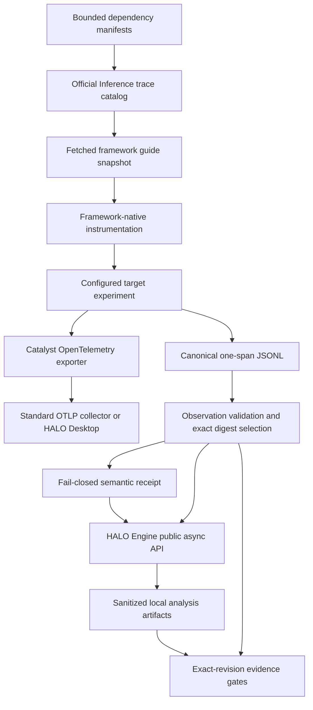

# Observability and trace evidence

Shea Halo uses traces as local research evidence, not as a hosted telemetry product. The shipped pipeline discovers the target's framework, prefers that framework's native tracing integration, exports live OpenTelemetry through Catalyst to a standard OTLP collector, writes a separate canonical one-span-per-line JSONL dataset, normalizes a bounded semantic receipt, and asks the open-source HALO Engine to analyze the selected dataset. The resulting evidence feeds the exact-revision gates in the [Halo Research lifecycle](/openwiki/workflows/research-lifecycle.md); its endpoints, credentials, private application data, and raw model/tool payloads remain inside the [security and trust boundary](/openwiki/architecture/security.md) (`README.md`, `src/shea_halo/agent.py`, `src/shea_halo/observation.py`, `src/shea_halo/halo_engine.py`).

## Shipped data flow

*One instrumented experiment has two independent outputs: live OTLP delivery for observation and canonical JSONL for deterministic evidence and HALO analysis.*

## Framework-native guide selection

There is no hardcoded framework-to-instrumentation table. `IntegrationCatalog` always starts from the protocol constant `https://docs.inference.net/llms.txt`, accepts only HTTPS Markdown links below `docs.inference.net/integrations/traces/`, and stores bounded cache files below the target's managed `.shea` runtime area. `discover_dependencies` scans bounded `package.json`, `pyproject.toml`, requirements, Cargo, and Go manifests while skipping runtime, dependency-install, build, and VCS trees. `rank_guides` then scores the current catalog against dependency names and versions (`src/shea_halo/integrations.py`; `tests/test_integrations.py`).

The investigator can list the full current catalog, inspect dependency-ranked candidates, and fetch a guide only if its URL is in that catalog. A selected `GuideSnapshot` records the URL, retrieval time, content digest, dependency evidence, selection reason, and stale status. If network access fails, a cached catalog or guide is explicitly stale; stale guidance can support more research but a `ready_for_todo` result is demoted to `continue_research` (`src/shea_halo/agent.py::selected_snapshots`, `IntegrationCatalog.fetch_guide`).

The governing order is **native first**: fetch the exact current official guide for the detected framework/version, apply its native integration, measure coverage, and add manual OpenInference spans only for demonstrated lifecycle gaps. This avoids a Shea-specific framework fork and duplicate spans. For the FailureReport example, the maintained README reports dependency evidence `eve ^0.24.4` and selection of the official Vercel Eve guide; that is a research input, not proof that the example already ships the proposed instrumentation (`README.md`, `examples/failure-report/.shea/halo.toml`).

## Catalyst, OTLP, and the dual-output contract

Shea Halo instruments its own investigator and final synthesis with `inference-catalyst-tracing`: `setup` creates the tracing provider, `agent_span` wraps the agent operation, and `manual_span` gives constrained tools OpenInference `TOOL` spans. The configured SDK base endpoint, or `CATALYST_OTLP_ENDPOINT`, is normalized because Catalyst appends `/v1/traces`; `CATALYST_SERVICE_NAME` identifies the service and candidate validation adds `CATALYST_SERVICE_VERSION` equal to the exact candidate SHA (`src/shea_halo/agent.py`). HALO Engine receives the same normalized endpoint and emits its own telemetry to a temporary local file before a sanitized projection is persisted (`src/shea_halo/halo_engine.py`).

A target-owned tracing experiment has a stricter dual-output contract:

1. use public framework and OpenTelemetry APIs to export the run to the configured standard OTLP endpoint;
2. atomically replace a configured canonical JSONL file with the same run's spans, one span per line;
3. await exporter flush/shutdown; and
4. exit nonzero if OTLP delivery is rejected.

The successful configured-action exit is the delivery receipt. OTLP envelopes such as `resourceSpans` are not canonical HALO JSONL, and there is no Desktop-to-JSONL bridge or Shea-specific receiver (`src/shea_halo/agent.py::INVESTIGATOR_INSTRUCTIONS`; `tests/test_halo_engine.py::test_otlp_envelope_is_not_misrepresented_as_engine_jsonl`).

## HALO Desktop is an optional public boundary

HALO Desktop may be the operator-managed OTLP collector and richer live viewing surface, but Shea Halo does not discover, start, stop, configure, enumerate, or inspect the Desktop process. It does not read Desktop SQLite, private APIs, WebSockets, trace lists, or application-data paths. Exported `report.md` files matching configured globs are bounded, redacted supplemental investigator input; they are not required for complete trace validation (`src/shea_halo/agent.py::load_desktop_reports`, `src/shea_halo/observation.py`; `tests/test_observation.py::test_complete_trace_validation_treats_desktop_report_as_supplemental`).

Desktop probing is disabled by default. With `desktop_preflight = "external"`, the worker performs one bounded pre-research check against only the derived public `GET /health` and OTLP/JSON `POST /v1/traces` paths. It follows no redirects, requires the allowlisted `halo-canvas-telemetry` service identity, and sends a deterministic synthetic span containing no model I/O, tool payload, credential, endpoint, or host path. The durable receipt retains only classification, status classes, timestamps, service identity when accepted, and payload digest. Passing proves only public-surface ingest acceptance—not durable storage or UI visibility; failure produces a sanitized structured external blocker (`src/shea_halo/integrations.py::preflight_halo_desktop`, `src/shea_halo/service.py`; `tests/test_integrations.py`, `tests/test_service.py`).

Live OTLP remains a trusted operator boundary and may contain application data. The operator must secure the collector and choose target instrumentation deliberately; canonical JSONL remains the required promotion evidence.

## Canonical JSONL and observation selection

The canonical contract is read dynamically from the installed public HALO Engine `SpanRecord` model rather than copied into framework-specific instructions (`src/shea_halo/agent.py::canonical_trace_contract`). `observation.py` discovers configured trace and optional Desktop-report globs under both the target checkout and managed experiment worktree. It rejects path escapes, unstable or oversized files, invalid records, malformed identifiers, duplicate spans, missing parents, self-parenting, and parent cycles. Persisted inventory uses logical `target/` or `worktree/` labels, digests, counts, kinds, service-version summaries, and semantic receipts—never host paths.

Candidate evidence is narrower than the observation history. During post-publication validation, setup establishes an experiment baseline; the configured runtime experiment creates a second checkpoint; verification creates a final checkpoint. Only new or changed **worktree** traces introduced by the experiment and unchanged after verification survive as candidate traces. HALO Engine then receives exactly their SHA-256 digests. Complete validation requires at least one parented span, every candidate span bound to the candidate SHA through `resource.attributes["service.version"]`, an exact digest match between candidate observations and the HALO dataset, the same candidate revision in the HALO manifest, and a report digest. Desktop reports remain supplemental (`src/shea_halo/service.py::_stable_experiment_observations`, `_trace_validation`; `src/shea_halo/observation.py::TraceValidation`).

This exact-dataset flow is how observability supplies authoritative evidence to the [research lifecycle's candidate validation](/openwiki/workflows/research-lifecycle.md), rather than allowing exploratory traces or a model claim to justify handoff.

## Semantic normalization and fail-closed attribution

Canonical structure alone does not make semantically equivalent framework attributes comparable. `project_trace_semantics` recognizes bounded aliases from OpenInference, OpenTelemetry `gen_ai.*`, Vercel AI SDK `ai.*`, and Eve `$eve.*` for span kind, agent identity, requested/response model identity, and token usage (`src/shea_halo/trace_semantics.py`).

The projection preserves provenance as trace/span identifiers and source attribute keys while omitting raw attribute maps. Identical aliases are retained as multiple sources without double counting. Conflicting aliases, invalid values, incomplete token pairs, bad topology, excessive bounds, tokenized LLM spans without an identified AGENT ancestor, and ambiguous token ownership fail closed with raw-value-free conflict evidence. Token totals include only complete input/output usage on attributable LLM spans. Enclosing Eve turn aggregates must agree with directly attributable child LLM totals but are not added again; inherited `$eve.type=turn` does not reclassify child AGENT, LLM, or TOOL operations. The July 2026 semantic-normalization commits introduced this boundary and then corrected inherited Eve turn attribution for real trace shapes.

Both observation inventory and HALO Engine trace loading attach the same `TraceSemanticReceipt` and stable digest. HALO's prompt treats this receipt—not model interpretation of raw aliases—as authoritative for agent attribution and token arithmetic. `analysis.json` therefore carries bounded totals, identities, source IDs/keys, contribution links, and receipt digests without copying prompts, outputs, tool payloads, endpoints, or arbitrary attributes (`src/shea_halo/observation.py`, `src/shea_halo/halo_engine.py`; `tests/test_trace_semantics.py`).

## HALO Engine and local artifacts

`HaloEngineAdapter` uses HALO Engine's public async Python entry points. Preliminary analysis may use all discovered canonical traces; post-publication analysis uses only the required candidate digests. The manifest binds each logical trace label and digest to the managed worktree HEAD as `harness_revision`, includes complete semantic receipts and derived totals, and passes a sanitized semantic context to the engine (`src/shea_halo/halo_engine.py`).

Indexes, raw events, and raw HALO telemetry live in a per-run temporary directory. The durable, ignored run directory contains only sanitized outputs:

- `analysis.json`: engine/API mode, exact dataset manifest, safe prompt summary, and logical artifact names;
- `events.jsonl`: bounded event summaries and content digests;
- `report.md`: the sanitized final HALO report; and
- `halo-telemetry.jsonl`: a sanitized local projection of HALO's telemetry.

Unsafe run IDs, path escapes, symlink/hardlink tricks, host paths, credential-shaped values, malformed output, or a missing final report fail closed. On hosts without the semaphore capacity required by HALO's normal process pool, Shea Halo prebuilds compatible indexes with an isolated serial subclass; it does not modify HALO Engine's global implementation (`src/shea_halo/halo_engine.py`; `tests/test_halo_engine.py`). These local artifacts are evidence inputs, while only bounded receipts and digests may cross into the public append-only workpad under the [security model](/openwiki/architecture/security.md).

## FailureReport evidence: what it proves and what it does not

The committed `tests/fixtures/eve-semantics/` records are explicitly synthetic. `synthetic-public-aggregate.jsonl` was calibrated to the accepted public FailureReport totals of **498,161 input tokens** and **22,392 output tokens**. Tests prove alias normalization, topology/provenance handling, agent rollups, exclusion of enclosing Eve aggregates, and arithmetic against those published numbers. Negative fixtures prove fail-closed behavior for conflicts, missing attribution, and double-count risks (`tests/fixtures/eve-semantics/README.md`, `tests/test_trace_semantics.py`).

The committed fixtures alone do **not** prove that Shea Halo parsed, exported, or derived data from the real FailureReport source traces, and they contain no model inputs/outputs, tool arguments/results, endpoints, credentials, or host paths. The append-only [FailureReport #26 research record](https://github.com/Alive24/FailureReport/issues/26) separately records the authorized native-Eve analysis and public HALO Desktop/HALO Engine acceptance evidence. That evidence remains a research record rather than committed raw trace data or shipped FailureReport instrumentation.

## Current behavior versus open issue #9

**Shipped now:** framework-guide discovery and snapshots, Catalyst tracing of Shea Halo's own agent/tools, target dual OTLP plus canonical-JSONL guidance, optional bounded Desktop preflight, deterministic observation checkpoints, exact candidate-digest HALO analysis, semantic receipts, sanitized local artifacts, and revision-bound evidence references.

**Not shipped:** a first-class “complete research trace bundle” that packages the whole research lifecycle as one modeled artifact. Open [Shea Halo #9, “Capture complete research trace bundles through a Catalyst-native local pipeline”](https://github.com/Alive24/shea-halo/issues/9) defines that future contract, but current tracked Python and tests contain no trace-bundle model, serializer, lifecycle attachment, or `bundle` implementation. Do not describe #9 as current behavior. The existing `TraceDatasetManifest`, observation checkpoints, workpad records, and HALO artifact directory are related evidence structures, but together they are not an implemented issue-#9 bundle.

## Change and verification guide

Start changes in the component that owns the contract:

| Change | Source | Focused checks |
|---|---|---|
| Catalog, dependency detection, guide ranking, Desktop public preflight | `src/shea_halo/integrations.py` | `uv run pytest tests/test_integrations.py tests/test_config.py` |
| Investigator Catalyst spans, target environment, guide snapshots, canonical-contract tool | `src/shea_halo/agent.py` | `uv run pytest tests/test_agent_boundaries.py` |
| Discovery, canonical validation, checkpoints, candidate summaries | `src/shea_halo/observation.py` | `uv run pytest tests/test_observation.py` |
| Alias normalization, attribution, token arithmetic, receipt safety | `src/shea_halo/trace_semantics.py` | `uv run pytest tests/test_trace_semantics.py` |
| Exact trace selection, HALO API, sanitization, local artifacts | `src/shea_halo/halo_engine.py` | `uv run pytest tests/test_halo_engine.py` |
| Candidate-stage ordering and exact-revision gates | `src/shea_halo/service.py` | relevant tracing, Desktop, and validation cases in `tests/test_service.py` |

Preserve the dual-output separation, public-only Desktop boundary, exact digest/revision binding, semantic fail-closed behavior, and local-only persistence rules. Then run the repository-wide checks listed in the [architecture and source map](/openwiki/architecture/overview.md).
