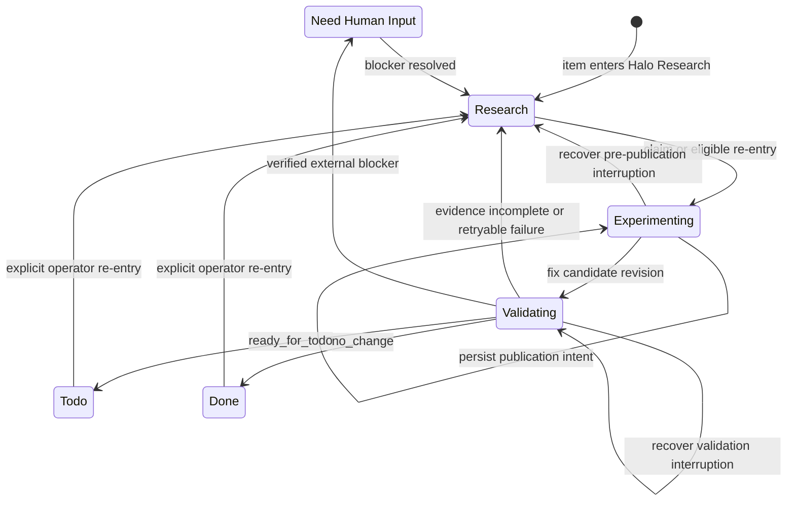

# Halo Research lifecycle

A configured GitHub Project item is Shea Halo's control plane. The worker acts only while the item is in the configured `research_state`—normally `Halo Research`—and records each durable step as a new Issue comment. Research that proves an implementation is warranted moves the same item to `Todo`; implementation then belongs to the separate [Shea Symphony workflow and worktree](/openwiki/architecture/overview.md), not to Halo's experimental branch (`README.md`, `src/shea_halo/service.py`, `.shea/workflows/shea-symphony.md`).

## Lifecycle at a glance



The diagram combines Halo's persisted phases (`research`, `experimenting`, and `validating`) with the configured Project states reached by terminal outcomes. Project status remains `Halo Research` throughout the internal research phases.

## Project states and outcome routing

`Outcome` and `HaloState.phase` are strict persisted models. The service gates evidence before mapping an outcome to a Project status (`src/shea_halo/models.py`, `src/shea_halo/service.py`):

| Result after gating | Persisted phase | Project action | Meaning |
|---|---|---|---|
| `continue_research` | `research` | No status write | Evidence, verification, or synthesis remains incomplete. |
| `ready_for_todo` | `ready` | Move to configured `ready_state` (`Todo`) | Research supports implementation and includes the required handoff evidence. The Halo branch remains reference-only. |
| `no_change` | `done` | Move to configured `done_state` (`Done`) | The hypothesis is resolved without a recommended implementation. |
| `blocked` | `blocked` | Move to configured `blocked_state` (`Need Human Input`) | A structured, verified external dependency requires operator action. |

`Need Human Input` is not a generic failure lane. A blocked result must carry an `ExternalBlocker` in one of the modeled categories—credential, network, permission, missing input, or unavailable service—with a description and required action. For experiment failures, verification requires one configured candidate-validation action at the exact candidate revision to return an allowlisted external-blocker exit code; ordinary nonzero exits remain research evidence. Missing model credentials, an unsupported configured provider API route, unsafe validation cleanup, and base-branch drift also have explicit fail-closed blocker paths (`src/shea_halo/models.py`, `src/shea_halo/service.py`).

Terminal routing is itself journaled. `_finish` first appends a `pending` `StatusTransition`, then writes the Project field, then appends an `applied` transition. If the status write succeeded but the final comment did not, later polling reconciles the pending transition. If another workflow has already advanced the item to a different status, Halo records that the pending transition was superseded and does not move the item backward (`src/shea_halo/service.py`; `tests/test_service.py::test_finish_persists_pending_then_applied_status_transition`, `test_terminal_item_reconciles_applied_comment_after_status_write`, and `test_downstream_project_status_supersedes_a_pending_halo_target`).

## Append-only workpad as durable state

Each lifecycle checkpoint is a new Issue comment beginning with `<!-- shea-halo-workpad -->`. The comment presents a sanitized summary first and a folded canonical JSON `WorkpadEntry` containing the full strict `HaloState`. Each entry has a consecutive revision and the database ID of its predecessor; Halo never edits the Issue body or an existing workpad comment (`src/shea_halo/workpad.py`, `src/shea_halo/models.py`).

On every pass, `find_head` reconstructs exactly one trusted linear history. It fails closed on malformed trusted entries, edits after creation, missing predecessors, forks, cycles, disconnected histories, non-consecutive revisions, repository or Issue mismatches, and producer/author mismatches. Marker-like comments by authors outside the current worker and configured `trusted_producers` allowlist remain ordinary Issue discussion rather than lifecycle state. Rendered summaries and structured values are sanitized, bounded to the safe comment size, and do not expose credential-shaped values or host paths (`src/shea_halo/workpad.py`; `tests/test_workpad.py`). These controls are part of the broader [security and trust boundaries](/openwiki/architecture/security.md).

The durable state pins the run ID, stable branch name, base revision, published snapshot, publication intent, validation baseline, input fingerprint, result, and pending/applied Project transition as applicable. Model validators prevent invalid combinations—for example, `validating` requires a base revision, preliminary result, and observation baseline, while publication intent is valid only during `experimenting` (`src/shea_halo/models.py`).

## Research, publication intent, and snapshot authority

A first pass claims the item, derives a stable `halo/issue-<number>-<slug>` branch name, and prepares a managed worktree from the current remote base revision. That base SHA remains pinned for the lifecycle. A later Issue rename does not rename the persisted branch (`src/shea_halo/service.py`, `src/shea_halo/workspace.py`).

The investigator may explore and change files, but Git publication starts only when the current attempt reports changed paths and the workspace actually has a validated source delta. Before committing or pushing, Halo appends a `PublicationIntent` containing:

- the Halo branch;
- the exact parent revision;
- a digest of the canonical manifest; and
- each intended file or deletion with its content identity, size, and executable state.

`WorkspaceManager` then rechecks the worktree against that immutable intent, validates commit parent, tree, metadata, remote identity, and remote branch state, and pushes the exact commit. Replaying the same intent after a crash is idempotent; content changed after intent, an unexpected commit, or a conflicting remote branch fails closed (`src/shea_halo/workspace.py`; `tests/test_workspace.py::test_publication_intent_recovers_after_push_before_workpad_finalization` and `test_publication_intent_rejects_changes_after_it_was_recorded`).

The resulting `BranchSnapshot` always has `reuse_policy: experimental_snapshot_only`. It is evidence for review or selective cherry-picking, not an implementation branch: no PR should be opened from it and development must not continue on it. Before restoration, publication, validation, and handoff, the service checks the complete PR history for the exact Halo branch. The implementation boundary is enforced by the configured Symphony contract, whose active implementation states are `Todo` and `Rework` and whose worktree root is separate (`README.md`, `src/shea_halo/service.py`, `.shea/workflows/shea-symphony.md`).

## Exact-revision candidate validation

Validation begins only after the candidate revision is fixed: the published snapshot SHA when source changed, otherwise the pinned base SHA. `prepare_validation_workspace` rejects unrecorded source changes and removes ignored state from the managed worktree so setup and experiments rebuild their inputs from that revision (`src/shea_halo/workspace.py`).

The service then performs this ordered protocol (`src/shea_halo/service.py::_validate_candidate`):

1. Persist the pre-validation observation baseline.
2. Run every configured setup action with the candidate SHA as `service_version`.
3. Inventory observations again to exclude setup output from candidate evidence.
4. Run every configured experiment action at the candidate SHA.
5. Freeze the post-experiment observation checkpoint.
6. Run deterministic verification at the same SHA.
7. Inventory once more and accept only experiment-created or changed worktree observations whose complete inventory record survived verification unchanged.
8. Reject and discard any source mutation made after publication.
9. Analyze exactly the selected candidate trace digests with HALO Engine.
10. Run a separate read-only final synthesis, validate its evidence references, gate the outcome, and route the Project item.

Observation checkpoints use stable logical labels under `target/` or `worktree/`, file digests, bounded metadata, and canonical trace summaries rather than host paths. A complete tracing validation requires candidate traces with a real parent/child hierarchy, an exact HALO dataset digest match, HALO's dataset revision equal to the candidate SHA, and every span in every selected trace carrying that same service version. Candidate observations and HALO evidence are detailed in [observability and trace evidence](/openwiki/workflows/observability.md) (`src/shea_halo/observation.py`, `src/shea_halo/service.py`).

A `ready_for_todo` result must also have evidence, implementation guidance, successful revision-bound experiments tied to their action receipts, successful setup and deterministic verification, and runtime HALO analysis. A `no_change` result has the same runtime, evidence, and verification standard except it carries no implementation handoff. If tracing validation is required, both outcomes additionally require current—not stale—selected guidance and complete trace validation. Unsupported terminal claims are demoted to `continue_research` (`src/shea_halo/service.py::_gate_outcome`; exact-revision contracts in `tests/test_service.py` and `tests/test_observation.py`).

## Re-entry semantics

Returning any previously processed item to `Halo Research` is an explicit request to re-enter the same append-only lifecycle. Halo preserves the run ID, branch, base revision, snapshot, and prior result; it reconstructs ordinary Issue discussion separately from trusted workpad comments and reruns branch and workspace integrity checks before model work (`src/shea_halo/service.py`; `tests/test_service.py::test_explicit_move_back_to_halo_research_reenters_finalized_workpad`).

For an incomplete result, Halo computes an input fingerprint over the Issue title/body and bounded discussion, observation checkpoint, snapshot, effective experiment contract and model settings, runtime source digest, a daily refresh value, normalized collector endpoint, and only the presence—not values—of allowlisted experiment environment variables. If the prior outcome is `continue_research` and the fingerprint is unchanged, the poll is a no-op. New discussion or artifacts, branch/configuration changes, runtime changes, newly available capabilities, or the daily refresh make the item eligible again (`src/shea_halo/service.py::_input_fingerprint`; history in `e958843`). A validation or final-synthesis failure deliberately stores no fingerprint so the next pass can retry cleanly.

If the configured remote base has advanced beyond the persisted base SHA, re-entry stops and routes to `Need Human Input`. Halo will not apply old evidence to the new revision; the maintained contract directs operators to start a fresh research lifecycle for the new base or explicitly review the pinned snapshot (`src/shea_halo/service.py::_base_revision_drift_result`; `tests/test_service.py::test_base_branch_drift_fails_closed_without_running_investigator`).

## Interruption, failure, and recovery

Recovery is state-specific and never guesses past an unrecorded side effect:

| Durable head at restart | Recovery behavior |
|---|---|
| `experimenting` with no result or publication intent | Validate the managed path, branch, base, HEAD, and remote state; reset to the persisted base or snapshot; remove tracked, untracked, and ignored attempt state; append recovery; restart research. |
| `experimenting` with publication intent | Restore the exact intended workspace, finish or confirm the idempotent publication, record the snapshot and validation baseline, then validate without rerunning the preliminary investigator. |
| `validating` with result and baseline | Restore the exact snapshot, discard branch-external worktree state, append recovery, and rerun revision-bound validation from the persisted baseline. |
| Terminal phase with `pending` status transition | If GitHub has the intended status, append `applied`; if a different later status exists, append a supersession record and do not rewrite status. |

A normal exception before publication discards unpublished source and ignored worktree state, appends a sanitized `continue_research` failure, and retains the Project item in `Halo Research`. A validation failure restores the published snapshot and removes changed worktree observation artifacts only when they remain inside the managed cleanup boundary; inability to clean safely becomes a verified permission blocker. Final synthesis failure keeps the published snapshot, discards branch-external state, records `continue_research` with no fingerprint, and never falls back to the preliminary conclusion (`src/shea_halo/service.py`, `src/shea_halo/workspace.py`, `src/shea_halo/observation.py`; recovery tests in `tests/test_service.py` and `tests/test_workspace.py`).

If the preliminary investigator exhausts its configured turn budget after producing changes, Halo still checkpoints and validates the exact snapshot, but forces the final result back to `continue_research` and retains the checkpoint risk. This preserves useful evidence without allowing an incomplete investigation to claim `Todo`, `Done`, or a blocker (history in `c4e4ee7`; `tests/test_service.py`).

## Why the protocol is strict

The initial Issue-driven worker was hardened into this revision-bound protocol to make GitHub comments a recoverable journal rather than a progress log. The major lifecycle change introduced persisted base/snapshot lineage, exact candidate validation, intent-first publication, and status-transition recovery (`1352965`). Follow-up changes made unchanged incomplete work deterministic (`e958843`), preserved snapshots at turn limits (`c4e4ee7`), tightened publication identity and manifest checks (`d796c29`), and bound semantic experiment claims to exact runtime receipts (`2c29c90`). The result is intentionally conservative: ambiguous lineage, mutable evidence, unsafe cleanup, branch reuse, or insufficient proof stops routing rather than silently promoting research.

## Change and verification guide

When changing this lifecycle, start with the strict state invariants in `src/shea_halo/models.py`, then trace orchestration in `service.py`; workspace side effects belong in `workspace.py`, observation selection in `observation.py`, and comment-chain rules in `workpad.py`. Keep the README's product contract and `.shea/workflows/shea-symphony.md` authority boundary aligned.

Run the focused contracts before the full suite:

```text
uv run pytest tests/test_service.py tests/test_workpad.py tests/test_workspace.py tests/test_observation.py
uv run pytest
```

Pay particular attention to crash windows around publication and Project status writes, exact-SHA receipt binding, base drift, PR-history rejection, workpad trust/linearity, validation cleanup boundaries, and explicit re-entry from terminal Project states.